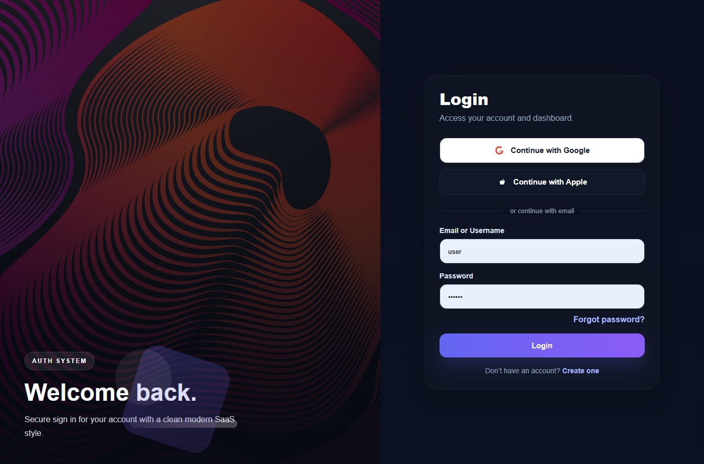
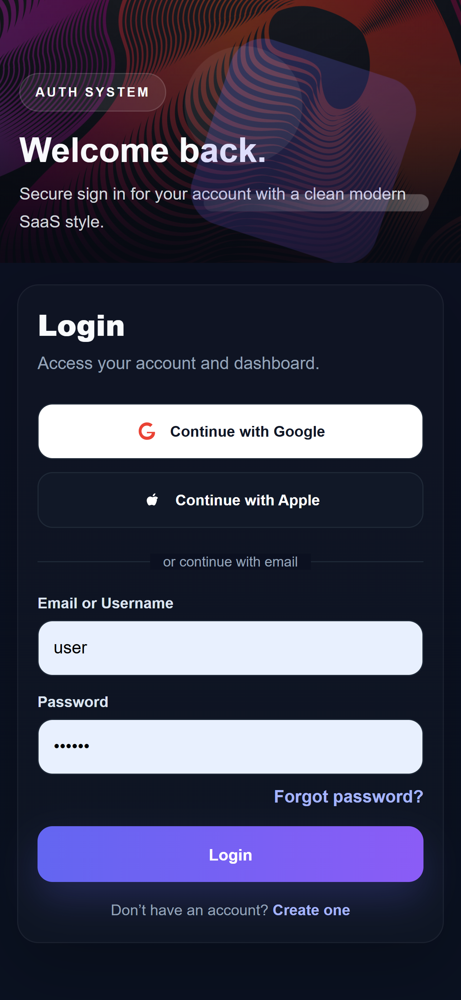
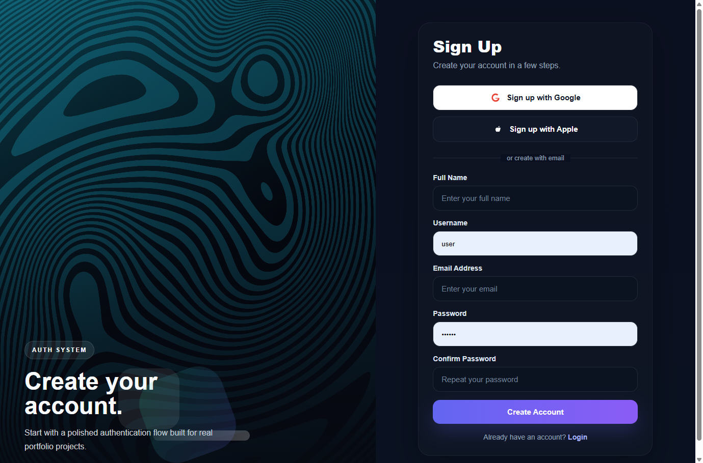
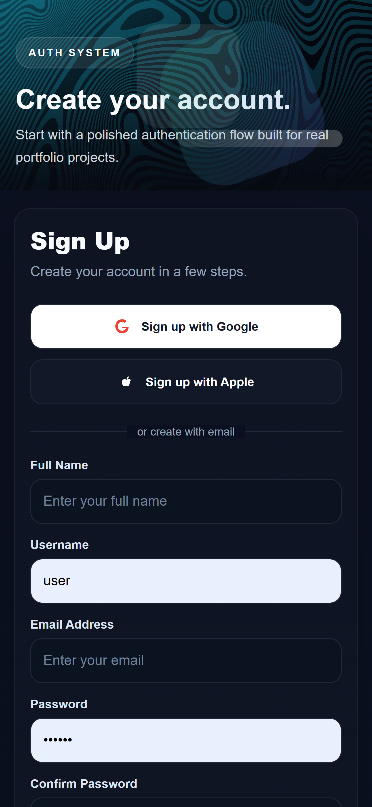
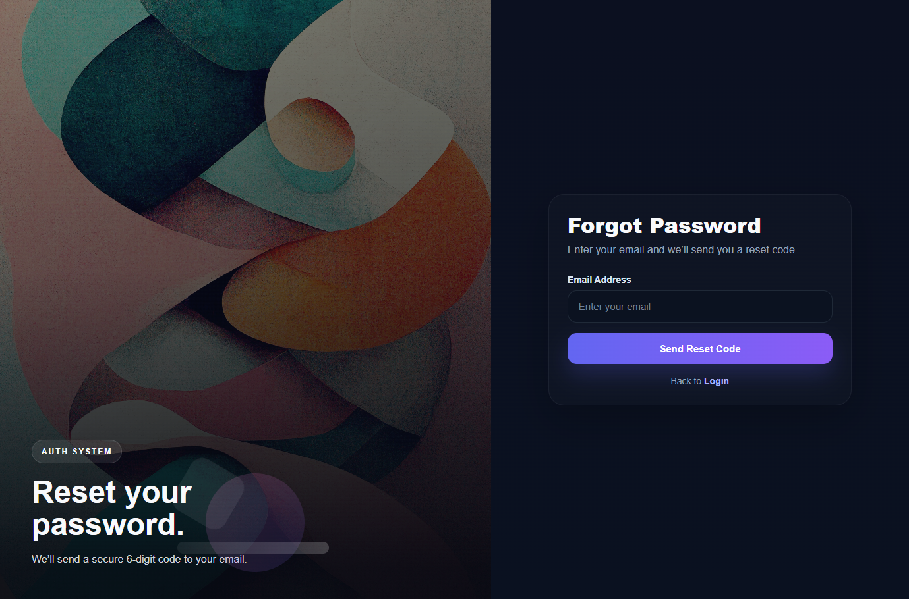
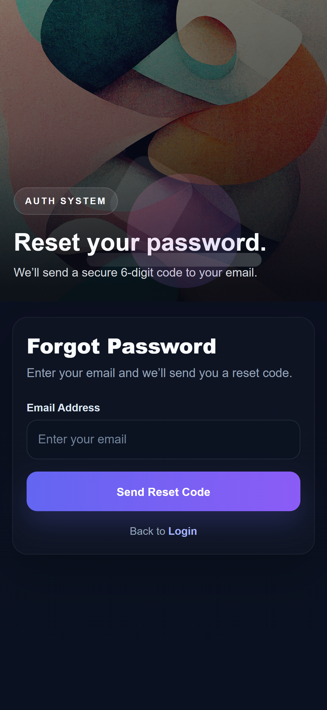

# PHP Auth System


A modern authentication system built with PHP, MySQL, PHPMailer, and XAMPP.

## Features

- User signup
- User login
- Session protection
- Forgot password flow
- 6-digit email verification code
- Reset password
- Responsive modern UI
- Google and Apple styled sign-in buttons

## Tech Stack

- PHP
- MySQL
- PHPMailer
- HTML
- CSS
- JavaScript
- XAMPP

## Setup

## Screenshots

### Login




### Signup




### Forgot Password




### 1. Clone project

```bash
git clone https://github.com/PicartWeb/Auth-system
```
